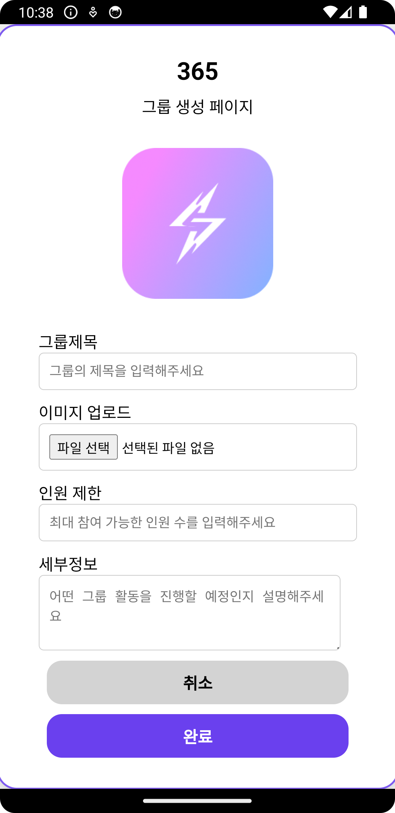
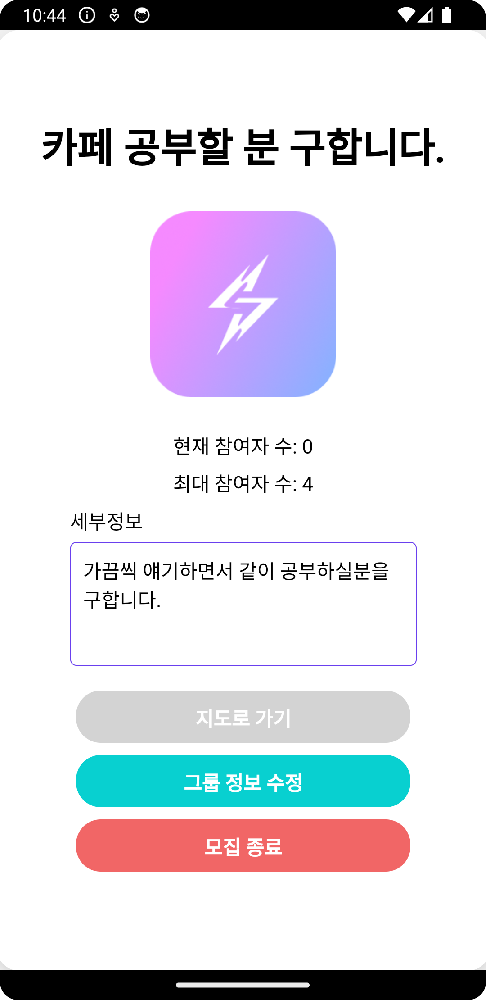

# PinPoint Meet You

A map-based meetup app for university students. Instead of a long group chat about where and when to meet, you tap one of the spots around campus and either open a group there or join the one already at it.

Built in the first half of 2024 as a 4-person university team project, and archived at the state it was in when the semester ended.

| Map | Create a group | Group detail |
|:---:|:---:|:---:|
|  |  |  |

**Stack** React · Redux Toolkit · Vite · Kakao Maps SDK · Node.js · Express · MongoDB (Mongoose) · Morpheus for WebView based Android packaging

## My role

Team lead of 4. I built the backend, covering data models, REST endpoints, validation, and file uploads, and brought the separately written frontend screens together into one app.

That second part took most of the time. Screens had been built standalone, so the work was putting them under shared routing and a single Redux store, settling on request and response shapes every screen could call, and wiring each one to the API.

## How it works

The map shows a fixed set of campus locations rather than free-form pins. Tapping one calls `GET /checkGroupData/:placeName` to see whether a group already exists there, and routes to the create screen or the join screen based on the answer. Because the lookup is keyed on the place name, groups carry no coordinates of their own.

Creating a group takes a title, capacity, description, and a cover image. Joining increments the participant count and closes the group once it reaches capacity.

Two things in the backend I would keep as they are. Signup validation runs as `express-validator` middleware ahead of the handler instead of inside it, so it is clear where a bad request gets rejected. And deleting a group unlinks its cover image, so removed groups leave nothing orphaned on disk.

The server was mid-migration when the project ended. It started out rendering Handlebars pages and was moving to a React SPA, so one Express app serves the built SPA, still renders `.hbs` templates, and returns JSON, with response shapes differing by endpoint.

## What I would do differently

**The capacity check is read-modify-write.** `joinGroup` reads the current count, adds one, and saves, so two people taking the last seat at the same moment can both get in. A single atomic update with capacity in the filter would close that.

**There is no session.** `POST /login` returns a success flag and nothing else, which leaves every group route unauthenticated. Passwords are also compared directly rather than hashed.

**Validation stops at signup.** Only one route has a schema, and each controller shapes its errors its own way. A schema per route and one error middleware would make the API predictable.

I went back and handled most of this properly in [SyncUp](https://github.com/Tae-uni/syncup), with Zod at the route boundary, a single error handler, and one consistent response shape.

## Running locally

Needs MongoDB on `localhost:27017`. `server/package.json` has no `scripts` block.

```bash
cd server && npm install && npx nodemon src/index.js   # :3000
cd client && npm install && npm run dev
```
